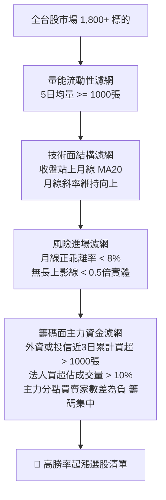

# 台股法人籌碼集中起漲選股策略技能 (Institutional Momentum & Chip Concentration Breakout)

## 一、策略核心邏輯

本策略結合**「籌碼面主力資金定價權」**、**「技術面多頭助漲結構」**與**「風控進場安全邊界」**三大維度，專門鎖定市場上**「主力大戶在起跑線吸籌、股價剛剛突破或站穩月線、且尚未噴出追高」**的黃金起漲標的。



### 核心篩選 7 大條件

#### 1. 籌碼面（主力資金追蹤）
1. **外資或投信近 3 個交易日累計買超大於 1,000 張**：
   - 意義：排除單日當沖或隔日沖自營商的短期灌水，確認具有外資或本土投信法人連續性布局建倉的波段決心。
   - 判定：$\sum_{t=0}^2 \text{ForeignNet}(t) > 1,000$ 或 $\sum_{t=0}^2 \text{TrustNet}(t) > 1,000$。
2. **法人買超張數佔當日總成交量比例大於 10%**：
   - 意義：法人資金不僅買超，更具備「盤面定價權」。買超佔成交量一成以上，代表當日推升股價的核心推手是法人真金白銀，散戶只是跟隨者。
   - 判定：$\frac{\text{InstNetToday}}{\text{VolumeToday}} \times 100\% \ge 10\%$。
3. **近 5 日前 15 大主力券商分點呈現淨買超，且買入分點家數小於賣出分點家數（籌碼集中）**：
   - 意義：透過分點籌碼追蹤，前 15 大特定主力帳戶持續吸納籌碼，且買方家數少於賣方家數（買賣家數差為負），代表籌碼正由廣大散戶零星手中移轉至極少數特定主力囊中，籌碼集中度大增。

#### 2. 技術面（趨勢與流動性）
4. **收盤價站上 20 日均線（月線），且月線斜率維持向上**：
   - 意義：月線（MA20）為波段生命線。站上月線且斜率向上（$\text{MA20}_t > \text{MA20}_{t-1}$），代表短中期多頭結構確立，均線扣抵低檔，對股價具有強烈的助漲與拉回支撐效應。
5. **近 5 日平均成交量大於 1,000 張**：
   - 意義：確保標的具備實質流動性，進得去、出得來，排除無量人造盤與掛單滑價過大的小型冷凍股。

#### 3. 風險與進場濾網
6. **收盤價與 20 日均線正乖離率小於 8%**：
   - 意義：嚴格遵守安全邊界，限定在「起漲區間或拉回支撐區」進場，堅決杜絕已經連拉兩三根漲停板、短線過熱（乖離過大）的追高被套風險。
   - 判定：$0\% \le \frac{\text{Close} - \text{MA20}}{\text{MA20}} \times 100\% < 8\%$。
7. **當日 K 棒無爆量長上影線（上影線長度需小於實體 K 棒的一半）**：
   - 意義：上影線代表高檔拋售賣壓或主力拉高出貨。上影線小於實體一半（$\text{UpperShadow} < 0.5 \times \text{Body}$），確保收盤買盤力道強勁且收在當日相對高點，次日延續上攻動能高。

---

## 二、觸發情境與語句

當使用者在對話中提到以下意圖時觸發此 Skill：
- 「幫我用法人籌碼和月線選股」
- 「外資投信買超大於1000張、月線向上的股票」
- 「找籌碼集中、法人佔比大於10%的起漲股」
- 「執行法人籌碼起漲選股策略」
- 「篩選收盤站上月線、乖離小於8%、無長上影線的標的」

---

## 三、快速執行方式

### 1. 透過 Python 自動化選股器 (串接證交所 API + yfinance)

專案選股腳本位置：
[`screener_institutional_momentum.py`](./screener_institutional_momentum.py)

#### 預設執行（自動抓取最新交易日盤後數據）：
```powershell
python "g:\我的雲端硬碟\台股選股策略\screener_institutional_momentum.py"
```

#### 匯出 CSV 或 Markdown 日報：
```powershell
# 匯出 CSV 報表
python "g:\我的雲端硬碟\台股選股策略\screener_institutional_momentum.py" --export "g:\我的雲端硬碟\台股選股策略\momentum_result.csv"

# 匯出 Markdown 報表
python "g:\我的雲端硬碟\台股選股策略\screener_institutional_momentum.py" --export "g:\我的雲端硬碟\台股選股策略\momentum_result.md"
```

#### 自訂參數調整：
```powershell
# 嚴格篩選：法人佔比 >= 15%、正乖離 <= 5%、外資/投信3日累計 >= 1500張
python "g:\我的雲端硬碟\台股選股策略\screener_institutional_momentum.py" --inst-ratio 15.0 --max-bias 5.0 --inst-3d 1500
```

### 2. 盤中即時雷達監控與 LINE 自動推播 (09:00 ~ 13:35)

盤中監控腳本位置：
[`intraday_momentum_scanner.py`](./intraday_momentum_scanner.py)

#### 啟動盤中即時監控：
- **手動雙擊啟動**：直接在檔案總管雙擊執行 [`start_momentum_intraday.bat`](./start_momentum_intraday.bat)。
- **命令列啟動**（預設每 60 秒掃描一次）：
  ```powershell
  python "g:\我的雲端硬碟\台股選股策略\intraday_momentum_scanner.py" --interval 60
  ```
- **單次快篩測試**：
  ```powershell
  python "g:\我的雲端硬碟\台股選股策略\intraday_momentum_scanner.py" --once
  ```
- **發送 LINE 模擬警報測試**：
  ```powershell
  python "g:\我的雲端硬碟\台股選股策略\intraday_momentum_scanner.py" --test-push
  ```
- **一鍵註冊 Windows 開盤自動排程（週一至週五 08:55 自動起跑）**：
  ```powershell
  powershell -ExecutionPolicy Bypass -File "g:\我的雲端硬碟\台股選股策略\setup_task_scheduler.ps1"
  ```

---

## 四、外部交易軟體串接指南

### 1. XQ 全球贏家（XS 選股腳本）
腳本檔案路徑：[`xq_institutional_momentum.xs`](./xq_institutional_momentum.xs)

- **使用方法**：
  1. 開啟 XQ 全球贏家，點選上方功能表「策略」→「選股中心」。
  2. 點選「新增自訂策略」，將 [`xq_institutional_momentum.xs`](./xq_institutional_momentum.xs) 代碼貼入。
  3. 執行頻率設定為「日線」。
  4. 點選「執行選股」，即可即時顯示所有符合三大法人累計買超、主力分點家數差與月線上揚之清單。

### 2. TradingView（Pine Script v5 圖表指標）
腳本檔案路徑：[`tradingview_institutional_momentum.pine`](./tradingview_institutional_momentum.pine)

- **使用方法**：
  1. 打開 TradingView 圖表，於底部打開「Pine Editor（Pine 編輯器）」。
  2. 將 [`tradingview_institutional_momentum.pine`](./tradingview_institutional_momentum.pine) 內容複製貼上並儲存「新增至圖表」。
  3. 圖表將以**亮綠色/橙紅色動態顯示月線斜率**，標示 **0%~8% 的起漲安全甜密區**，並自動過濾標記長上影線出貨 K 棒與多頭買點。

---

## 五、交易實戰 SOP（進退場與風控紀律）

### 1. 進場 Checklist（盤後選出，隔日盤中確認）
- [ ] **大盤環境**：加權指數處於月線之上或未出現系統性重挫（大盤順風勝率高）。
- [ ] **開盤動向**：次日開盤未跳空跌破昨日收盤價，且委買委賣比偏多。
- [ ] **分批建倉**：第一筆基本單於開盤站穩後進場（約 30%~50% 倉位），若盤中回測昨日均價有守再補齊剩餘部位。

### 2. 加碼條件
- 當股價突破近 10 日新高，且當日盤中量能放大、外資/投信持續聯手買超時，可加碼 1 次，加碼後平均成本不得高於月線正乖離 10%。

### 3. 停利機制 (Take-Profit)
- **第一目標（短波段停利）**：當月線正乖離拉大至 **+12% ~ +15%** 時，分批獲利了結 1/3 ~ 1/2。
- **波段移動停利（波段抱緊）**：以 **5 日均線（MA5）** 或 **10 日均線（MA10）** 作為移動停利線，未跌破續抱，跌破收盤無條件出場確保利潤入袋。

### 4. 嚴格停損機制 (Stop-Loss)
- **破線停損**：收盤價**有效跌破 20 日均線（月線）**超過 2%，或跌破進場當根 K 棒的最低點，無條件執行停損。
- **籌碼破功停損**：若進場後 1~2 個交易日內，原先買超的外資或投信突然出現**巨量轉賣（賣超超過進場當日買超量之一半以上）**，視為假突破或短線洗盤失敗，立即平倉離場。
